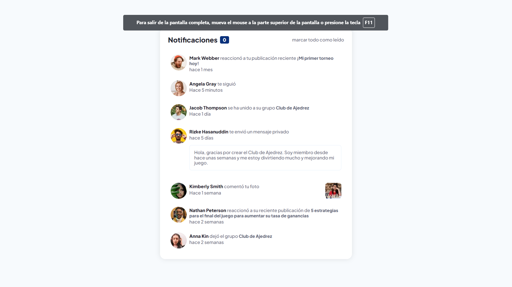

# Página de notificaciones

Esta es una solución al [desafío del Página de notificaciones en Frontend Mentor](https://www.frontendmentor.io/challenges/notifications-page-DqK5QAmKbC).

## Tabla de contenido

- [Resumen](#resumen)
  - [El reto](#el-reto)
  - [Captura de pantalla](#captura-de-pantalla)
  - [Enlaces](#enlaces)
- [Mi proceso](#mi-proceso)
  - [Construido con](#construido-con)
  - [Que aprendí](#que-aprendí)
  - [Desarrollo continuo](#desarrollo-continuo)
  - [Recursos útiles](#recursos-útiles)
- [Autor](#autor)
- [Agradecimientos](#agradecimientos)

## Visión general

### El reto

Los usuarios deben ser capaces de:

- Ver el diseño óptimo según el tamaño de pantalla de su dispositivo
- Ver estados de desplazamiento para elementos interactivos

### Captura de pantalla



### Enlaces

- URL de la solución: [https://github.com/denn-c/WEB-MENOR-pagina-de-notificaciones](https://github.com/denn-c/WEB-MENOR-pagina-de-notificaciones)
- URL del sitio en vivo: [https://denn-c.github.io/WEB-MENOR-pagina-de-notificaciones/](https://denn-c.github.io/WEB-MENOR-pagina-de-notificaciones/)

## Mi proceso

### Construido con

- Marcado HTML5 semántico
- Propiedades personalizadas de CSS
- Caja flexible

### Que aprendí

Diseñar, crear y mantener sitios web, proporcionando en el proceso un portal online coherente y fácil de usar para los clientes, compañeros de trabajo y otras partes implicadas. Incorporan contenido, imágenes, gráficos, vídeos y otras utilidades para crear sitios atractivos con los que los usuarios querrán interactuar.

Fragmentos de código con mayor relevancia en este proyecto.

**HTML**

```html
<p class="notifications__message">
  <a href="#" class="notifications__user">
    <strong class="notifications__name">Mark Webber</strong>
  </a>
  reaccionó a tu publicación reciente
  <a href="#" class="notifications__post"> ¡Mi primer torneo hoy!</a>
  <span class="notifications__marker"></span>
</p>
```

**CSS**

```css
.notifications {
  display: flex;
  align-items: flex-start;
  margin-bottom: 0.5em;
  background-color: var(--Very-light-grayish-blue);
  padding: 0.5em;
  border-radius: 0.3em;
}
```

**JS**

```css
$mark_all.addEventListener('click', () =>{
    $notifications.forEach(element => {
        if(!element.classList.contains('read')){
            element.classList.add('read')
        }
    });
    $amount.textContent = '0'
})
```

### Desarrollo continuo

- **Crear la codificación que da vida a un sitio web** y ayudar a que funcione según lo exigido por el host.
- **Diseñar no solo el aspecto de un sitio web**, sino también su funcionamiento para el usuario final.
- **Responsabilizarse de qué funciones se pueden realizar** cuando un usuario llega a la página web.
- **Utilizar los últimos mecanismos y aplicaciones** para que el sitio funcione de la forma más fluida y eficiente posible.
- **Probar sitios nuevos y existentes** y corregir posibles errores que puedan surgir.

### Recursos útiles

- [Conceptos básicos de HTML](https://developer.mozilla.org/es/docs/Learn/Getting_started_with_the_web/HTML_basics) - Esto me ayudó en escoger las etiquetas necesarias para maquetado del HTML. Me gustó mucho este patrón y lo usaré en el futuro.
- [CSS básico](https://developer.mozilla.org/es/docs/Learn/Getting_started_with_the_web/CSS_basics) Esto me ayudó en escoger las etiquetas necesarias para maquetado del CSS. Me gustó mucho este patrón y lo usaré en el futuro.

## Autor

- Facebook - [Dennys Chuyma](https://www.facebook.com/dennys.chuyma)
- Twitter - [denn](https://twitter.com/dennyschuyma)
- Mentor de frontend - [@denn-c](https://www.frontendmentor.io/profile/denn-c)

## Agradecimientos

Mis agradecimiento a los creadores de contenido de la comunidad de YouTube de indole educativo gracias a ellos fue posible la resolución de este desafió
